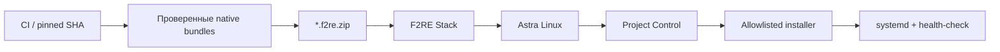

# F2RE Meta

[](https://github.com/f2re/meta/actions/workflows/project-control.yml)

**F2RE Meta / Project Control** — локальный центр контроля версий, состояния, перезапуска и офлайн-обновления приложений F2RE на Astra Linux. Рабочая реализация находится в [`project-control/`](project-control/).

## Вся система одним махом

На Linux-машине с интернетом:

```bash
git clone https://github.com/f2re/meta.git
cd meta/project-control
gh auth login
./scripts/f2re-stack.sh prepare
```

Скрипт скачает проверенные CI artifacts закреплённых версий `meta`, `docomator`, `planer-solving` и `kafedra-planner`; недостающий artifact в режиме `auto` будет пересобран штатным builder проекта. На выходе получается один переносимый набор:

```text
f2re-stack-<version>-astra-1.8-amd64.tar.gz
f2re-stack-<version>-astra-1.8-amd64.tar.gz.sha256
```

На Astra Linux 1.8:

```bash
sha256sum -c f2re-stack-*.tar.gz.sha256
tar -xzf f2re-stack-*.tar.gz
cd f2re-stack-*
sudo ./deploy-stack.sh
```

`deploy-stack.sh` устанавливает Project Control, затем через его штатный API последовательно обновляет все три приложения и после каждого требует совпадения версии и зелёного health-check. Подробности: [`project-control/docs/STACK.md`](project-control/docs/STACK.md).

## Поддерживаемые проекты

| Проект | Репозиторий | Adapter | Native release |
|---|---|---|---|
| Оформлятор | [`f2re/docomator`](https://github.com/f2re/docomator) | `docomator-v1` | `docomator-offline-v2` |
| Борис по парам | [`f2re/planer-solving`](https://github.com/f2re/planer-solving) | `planer-solving-v1` | `planner-solving-offline-v3` |
| Кафедра Planner | [`f2re/kafedra-planner`](https://github.com/f2re/kafedra-planner) | `kafedra-planner-v1` | `kafedra-full-airgap-v2` |

Полные проверенные commit SHA, имена GitHub Actions artifacts и эксплуатационный контракт находятся в [`project-control/config/managed-projects.json`](project-control/config/managed-projects.json). CI сверяет manifest со статическим runtime-allowlist.

## Отдельный meta-bundle

Если нужен только Project Control без приложений, остаётся отдельный артефакт:

```text
f2re-meta-<version>-astra-1.8-amd64.tar.gz
f2re-meta-<version>-astra-1.8-amd64.tar.gz.sha256
```

```bash
sha256sum -c f2re-meta-*.tar.gz.sha256
tar -xzf f2re-meta-*.tar.gz
cd f2re-meta-*
./verify.sh
sudo ./install.sh
```

Интерфейс по умолчанию: `http://<IP-сервера>:9090/`.

## Как проходит обновление



Project Control не исполняет команды из загруженного ZIP. Команды установки, systemd-службы, пути `current` и health endpoint зашиты в контроллер и версионируются через adapter ID.

## Документация

- [`project-control/README.md`](project-control/README.md) — эксплуатация Project Control.
- [`project-control/docs/STACK.md`](project-control/docs/STACK.md) — единая сборка/скачивание/развёртывание всей системы.
- [`project-control/docs/ASTRA_LINUX.md`](project-control/docs/ASTRA_LINUX.md) — отдельный meta-bundle на Astra Linux.
- [`project-control/docs/COMPATIBILITY.md`](project-control/docs/COMPATIBILITY.md) — матрица совместимости.
- [`project-control/docs/STANDARD.md`](project-control/docs/STANDARD.md) — формат `*.f2re.zip`, безопасность и deployment-контракт.

## Старый прототип

Первоначальный эксперимент 2020 года по маршрутизации метеорологических пакетов сохранён только для истории в [`legacy/2020-meteo-router/`](legacy/2020-meteo-router/). Он не является частью Project Control и не входит в F2RE Stack.
