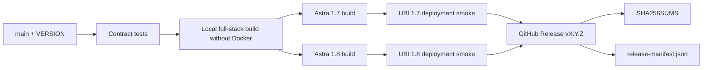

# F2RE Meta · Project Control

<p align="center">
  <strong>Единый offline-first центр обнаружения, мониторинга и безопасного обновления сервисов F2RE на Astra Linux.</strong>
</p>

<p align="center">
  <a href="https://github.com/f2re/meta/actions/workflows/project-control.yml"></a>
  <a href="https://github.com/f2re/meta/actions/workflows/release.yml"></a>
  <a href="https://github.com/f2re/meta/releases/latest"></a>
  <a href="https://github.com/f2re/meta/releases"></a>
  
  
  
</p>

**F2RE Meta / Project Control** сканирует реальный сервер (`/opt`, systemd, TCP LISTEN, nginx), определяет установленные проекты, показывает версии/health и безопасно применяет офлайн-обновления `*.f2re.zip`. Рабочая реализация находится в [`project-control/`](project-control/).

## Скачать последнюю стабильную версию

| Что скачать | Target | Прямая latest-ссылка | Проверка |
|---|---|---|---|
| **Meta bundle** | Astra Linux 1.7 amd64 | [f2re-meta-astra-1.7-amd64.tar.gz](https://github.com/f2re/meta/releases/latest/download/f2re-meta-astra-1.7-amd64.tar.gz) | [SHA-256](https://github.com/f2re/meta/releases/latest/download/f2re-meta-astra-1.7-amd64.tar.gz.sha256) |
| **Meta bundle** | Astra Linux 1.8 amd64 | [f2re-meta-astra-1.8-amd64.tar.gz](https://github.com/f2re/meta/releases/latest/download/f2re-meta-astra-1.8-amd64.tar.gz) | [SHA-256](https://github.com/f2re/meta/releases/latest/download/f2re-meta-astra-1.8-amd64.tar.gz.sha256) |
| **Portable controller** | Linux x64 | [project-control-linux-x64.tar.gz](https://github.com/f2re/meta/releases/latest/download/project-control-linux-x64.tar.gz) | [SHA-256](https://github.com/f2re/meta/releases/latest/download/project-control-linux-x64.tar.gz.sha256) |
| **Все release assets** | 1.7 + 1.8 | [GitHub Releases](https://github.com/f2re/meta/releases/latest) | [SHA256SUMS](https://github.com/f2re/meta/releases/latest/download/SHA256SUMS) |
| **Machine-readable inventory** | Release | [release-manifest.json](https://github.com/f2re/meta/releases/latest/download/release-manifest.json) | SHA внутри manifest + `SHA256SUMS` |

Каждый стабильный выпуск имеет тег `vX.Y.Z`, versioned assets, общий `SHA256SUMS` и `release-manifest.json`. Уже опубликованный SemVer release не перезаписывается.

## Быстрая установка

Astra Linux 1.7:

```bash
curl -fLO https://github.com/f2re/meta/releases/latest/download/f2re-meta-astra-1.7-amd64.tar.gz
curl -fLO https://github.com/f2re/meta/releases/latest/download/f2re-meta-astra-1.7-amd64.tar.gz.sha256
sha256sum -c f2re-meta-astra-1.7-amd64.tar.gz.sha256
tar -xzf f2re-meta-astra-1.7-amd64.tar.gz
cd f2re-meta-*-astra-1.7-amd64
./verify.sh
sudo ./install.sh
```

Для Astra Linux 1.8 замените `1.7` на `1.8`.

После установки:

```bash
curl -fsS http://127.0.0.1:9090/api/ping
sudo cat /root/project-control-access.txt
```

UI: `http://<server>:9090/` либо nginx path prefix, например `/project-control/`.

## Проверяемые платформы

| Платформа | Архитектура | CI | Deployment smoke | Release asset |
|---|---:|---|---|---|
| Astra Linux Special Edition **1.7** | amd64 | ✅ | официальный `astra/ubi17:1.7.5` | ✅ |
| Astra Linux Special Edition **1.8** | amd64 | ✅ | официальный `astra/ubi18-python311` | ✅ |
| Debian | amd64 | совместимая база | unit/installer contracts | portable controller |

CI проверяет не только архив контроллера: выполняются unit/contracts, реальная локальная сборка полного F2RE Stack без Docker, а затем распаковка и deployment smoke meta-bundle в обеих ветках Astra.

## Что умеет Project Control

- обнаруживает `docomator`, `planer-solving`, `kafedra-planner` по фактическим признакам;
- сканирует `/opt`, `current`, `VERSION`, systemd units и `ExecStart`;
- сканирует TCP LISTEN через `ss`;
- разбирает nginx `server_name`, `location`, `proxy_pass`, `client_max_body_size`;
- проверяет HTTP health на фактическом порту;
- показывает версию, путь, службы, proxy route и причины деградации;
- принимает большие `.f2re.zip` чанками и выполняет update отдельной job;
- сохраняет privilege boundary: web service непривилегирован, root executor доступен только через Unix socket;
- применяет только статически allowlisted native installers.

## Архитектура

```mermaid
flowchart LR
    UI[Web UI] --> API[Project Control web service]
    API --> D[Runtime discovery]
    D --> O[/opt + VERSION]
    D --> S[systemd]
    D --> P[TCP LISTEN]
    D --> N[nginx]
    API --> U[Chunk upload / async job]
    U --> X[Root executor via Unix socket]
    X --> V[Package identity + SHA / signature]
    V --> A[Allowlisted native installer]
    A --> H[systemd + HTTP health]
```

## Release pipeline



## F2RE Stack — вся система одним махом

На обычной Linux build-машине с интернетом:

```bash
git clone https://github.com/f2re/meta.git
cd meta
git pull --ff-only

./project-control/scripts/f2re-stack.sh prepare --astra 1.7
# или
./project-control/scripts/f2re-stack.sh prepare --astra 1.8
```

Это теперь основной режим: `prepare` по умолчанию локально собирает **meta + docomator + planer-solving + kafedra-planner** из закреплённых exact SHA и затем упаковывает единый stack.

**Docker не нужен. GitHub CLI не нужен. Системный Node.js не нужен.** Скрипт сам скачивает и проверяет standalone Node.js 24.19.0. Для `planer-solving` нужен `python3-venv`; для runtime — `curl` и `xz`.

Kafedra локально собирается штатным runtime-offline builder без контейнера. Это полноценное ядро приложения с автономным Node.js. OCR/Poppler/LibreOffice используются с целевой ОС, если установлены. Полный target-specific `full-airgap` Kafedra с `.deb`-слоем остаётся доступным как CI/download variant.

Если нужны готовые exact-SHA CI artifacts с локальным fallback:

```bash
cd project-control
gh auth login
./scripts/f2re-stack.sh prepare --astra 1.7 --source auto
```

Если нужны только готовые artifacts и локальная сборка запрещена:

```bash
./scripts/f2re-stack.sh prepare --astra 1.7 --source download
```

Подробно: [`project-control/docs/STACK.md`](project-control/docs/STACK.md).

## Управляемые проекты

| Проект | Repository | Adapter | Native format |
|---|---|---|---|
| Оформлятор | [`f2re/docomator`](https://github.com/f2re/docomator) | `docomator-v1` | `docomator-offline-v2` |
| Борис по парам | [`f2re/planer-solving`](https://github.com/f2re/planer-solving) | `planer-solving-v1` | `planner-solving-offline-v3` |
| Кафедра Planner | [`f2re/kafedra-planner`](https://github.com/f2re/kafedra-planner) | `kafedra-planner-v1` | `kafedra-full-airgap-v2` / `kafedra-runtime-offline-v1` |

Exact `verifiedCommit`, CI artifact names и deployment contract находятся в [`project-control/config/managed-projects.json`](project-control/config/managed-projects.json).

## Версионирование

Проект использует **Semantic Versioning**.

- `MAJOR` — несовместимый API/adapter/deployment contract;
- `MINOR` — новая совместимая возможность или поддерживаемая платформа;
- `PATCH` — совместимое исправление.

История: [`CHANGELOG.md`](CHANGELOG.md). Порядок выпуска: [`docs/RELEASING.md`](docs/RELEASING.md).

## Безопасность и качество

- [`SECURITY.md`](SECURITY.md) — политика сообщений об уязвимостях;
- [`CONTRIBUTING.md`](CONTRIBUTING.md) — требования к изменениям;
- release assets имеют SHA-256 и immutable SemVer policy;
- загруженный ZIP не может передать произвольную shell-команду root executor;
- Ed25519 release signatures можно сделать обязательными через `PROJECT_CONTROL_REQUIRE_SIGNATURE=true`.

## Документация

- [`project-control/README.md`](project-control/README.md) — эксплуатация и UI;
- [`project-control/docs/ASTRA_LINUX.md`](project-control/docs/ASTRA_LINUX.md) — Astra 1.7/1.8 build/deploy;
- [`project-control/docs/RUNTIME_DISCOVERY.md`](project-control/docs/RUNTIME_DISCOVERY.md) — `/opt` / systemd / ports / nginx discovery;
- [`project-control/docs/STACK.md`](project-control/docs/STACK.md) — one-shot stack;
- [`project-control/docs/COMPATIBILITY.md`](project-control/docs/COMPATIBILITY.md) — compatibility matrix;
- [`project-control/docs/STANDARD.md`](project-control/docs/STANDARD.md) — `.f2re.zip` contract;
- [`docs/RELEASING.md`](docs/RELEASING.md) — release engineering.

## Legacy

Эксперимент 2020 года по маршрутизации метеорологических пакетов сохранён в [`legacy/2020-meteo-router/`](legacy/2020-meteo-router/) только для истории и не входит в Project Control / release bundles.
